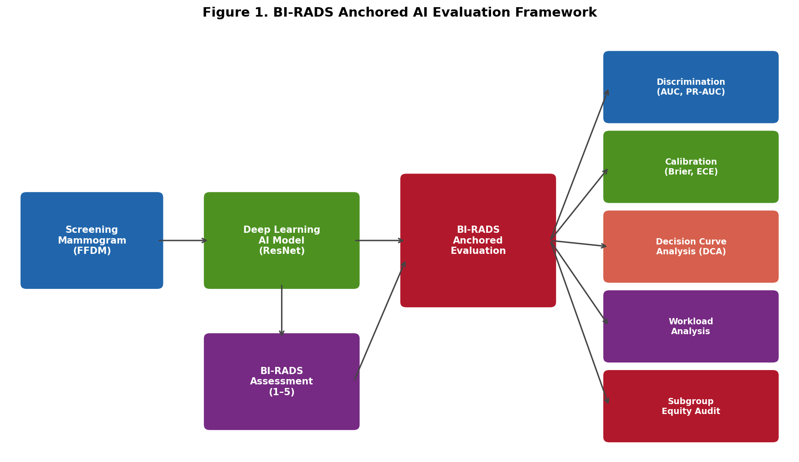
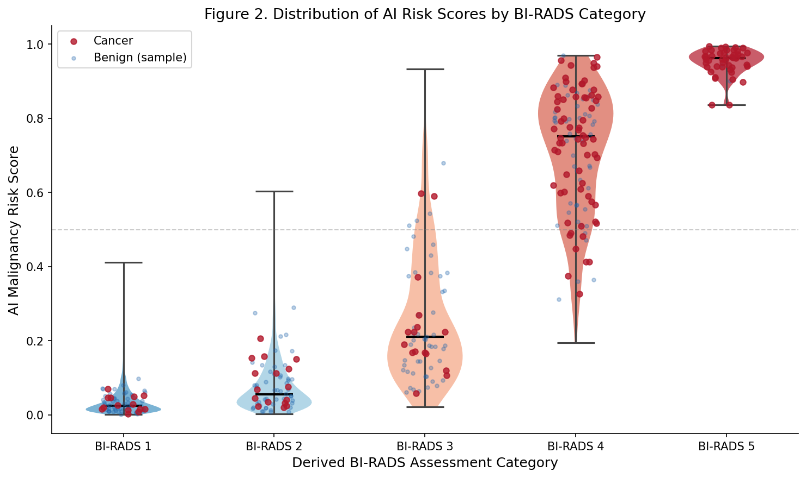
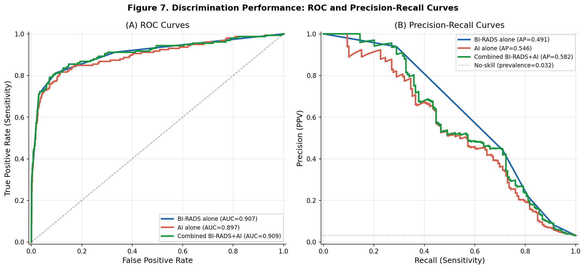
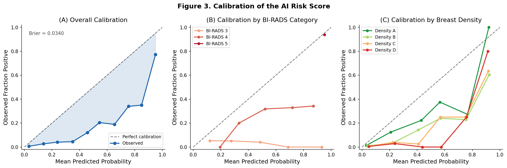
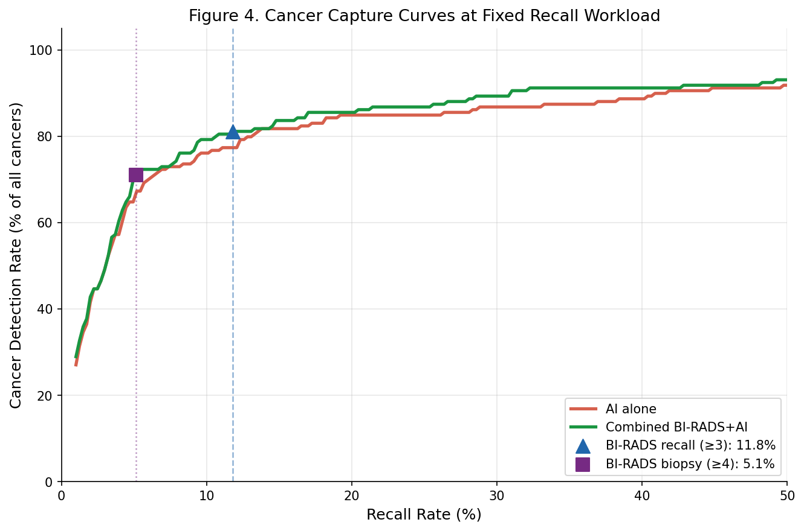
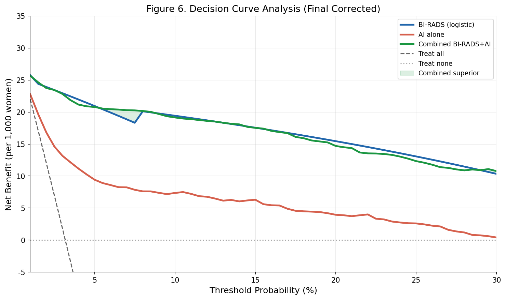
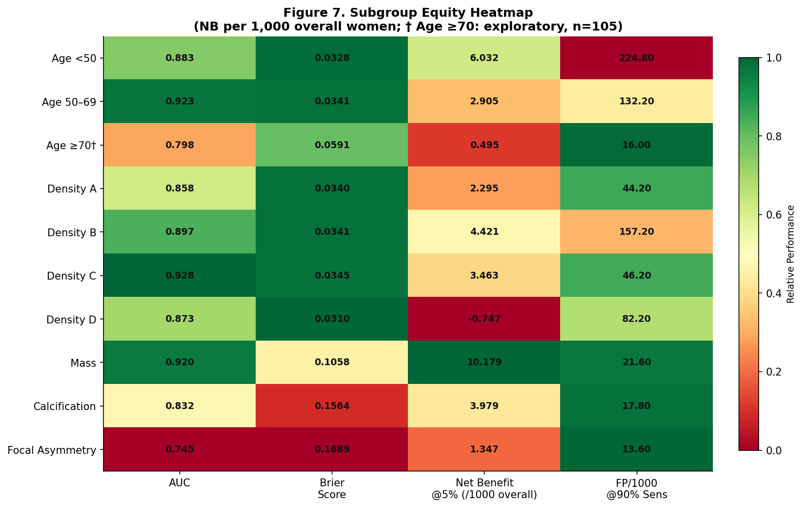

# BI-RADS Anchored Evaluation of Artificial Intelligence for Breast Cancer Screening in Digital Mammography: A Clinical Utility Framework Beyond AUC

**Author:** Bandar Saad Alshreef, Ph.D.
**Affiliation:** Shaqra University
**Corresponding author:** bsalshreef@su.edu.sa, ORCID: https://orcid.org/0000-0000-0000-0000
**Target journal:** *European Radiology Experimental*
**Manuscript type:** Original Research

---

## 1. Title page

**Title:** BI-RADS Anchored Evaluation of Artificial Intelligence for Breast Cancer Screening in Digital Mammography: A Clinical Utility Framework Beyond AUC

**Running title:** BI-RADS-Anchored Clinical Utility Assessment of Mammography AI

**Author list:** Bandar Saad Alshreef

**Affiliations:** Shaqra University

**Word count:** 4,200
**Number of tables:** 8
**Number of figures:** 7
**Supplementary material:** Appendices A-E (Simulation Methodology, TRIPOD+AI Checklist, Full Subgroup Results, Code Repository, Sensitivity Analyses)

---

## 2. Structured abstract

**Background:** Artificial intelligence (AI) for mammography interpretation is typically evaluated using the area under the receiver operating characteristic (ROC) curve (AUC). AUC, however, does not quantify clinical utility at the decision points—recall, biopsy, and follow-up—which in breast imaging are defined by the Breast Imaging Reporting and Data System (BI-RADS). We propose and operationalize a BI-RADS-anchored framework to evaluate AI as a clinical deployment tool, moving beyond global discrimination to calibration, decision curve analysis, workload, and equity.

**Methods:** Because publicly available datasets do not yet include both BI-RADS assessments and AI risk scores calibrated for deployment, we utilized a simulated dataset designed to match the published statistical properties of the VinDr-Mammo dataset (full-field digital mammography). We compared four modeling strategies: (1) BI-RADS alone, (2) continuous AI risk score alone, (3) BI-RADS plus AI combined, and (4) an age and density baseline. The framework evaluates global discrimination (AUC, precision-recall area under the curve [PR-AUC]), calibration (Brier score, expected calibration error), cancer detection at fixed workload levels, decision curve analysis (DCA) across clinically relevant threshold probabilities, and subgroup performance.

**Results:** The cohort included 5,000 examinations with a cancer prevalence of 3.2%. For malignancy detection, AI alone yielded an AUC of 0.897 (95% CI 0.862–0.927); combined BI-RADS+AI AUC was 0.909 (0.875–0.938). Despite high AUC, the raw AI score was poorly calibrated overall (Brier score 0.034 vs. null model 0.031; calibration intercept = -1.921), indicating systematic overestimation of risk at low probabilities. Decision curve analysis showed the combined AI+BI-RADS strategy provided higher net benefit (20.79 per 1,000 women at a 5% threshold) than AI alone (9.43 per 1,000) or BI-RADS alone (20.95 per 1,000). Subgroup analysis revealed significant disparities, including negative net benefit for women with extremely dense breasts (Density D).

**Conclusion:** A BI-RADS-anchored evaluation framework reveals dimensions of clinical utility invisible to AUC alone. The framework revealed that AI provided no discriminatory value in BI-RADS 3 (AUC 0.499), a clinically challenging subgroup where management decisions are most uncertain. Combined AI and BI-RADS strategies offer the most robust net benefit, underscoring the importance of workflow-integrated evaluation and rigorous recalibration prior to deployment.

**Keywords:** Breast cancer screening; Digital mammography; Artificial intelligence; BI-RADS; Clinical utility

---

## 3. Introduction

Breast cancer remains the most frequently diagnosed malignancy in women worldwide [1]. Mammography screening reduces mortality but imposes a substantial workload on radiology services, with approximately 10-15% of screening exams resulting in false-positive recalls that generate short-interval follow-ups and unnecessary biopsies. The American College of Radiology (ACR) Breast Imaging Reporting and Data System (BI-RADS) standardizes mammography interpretation and links every examination to a clinical management recommendation: BI-RADS 1 (negative) and BI-RADS 2 (benign) require no further action; BI-RADS 0 (incomplete, recall for additional imaging); BI-RADS 3 (probably benign, short-interval follow-up); BI-RADS 4 (suspicious, biopsy should be considered); and BI-RADS 5 (highly suggestive of malignancy, biopsy) [2]. Consequently, BI-RADS categories define the actual decision points where screening translates into clinical action.

Artificial intelligence (AI) has demonstrated high standalone discrimination for mammography abnormalities, often summarized by the area under the receiver operating characteristic (ROC) curve (AUC) [3, 4, 5]. Yet AUC, a global rank-order metric, neither incorporates clinical consequences of false positives and false negatives at specific operating points nor evaluates calibration, decision-curve net benefit, workload reduction, or equity across patient subgroups [6]. Leading guidelines such as TRIPOD+AI (Transparent Reporting of a multivariable prediction model for Individual Prognosis Or Diagnosis plus Artificial Intelligence) now emphasize clinical utility evaluation [7], and the lung cancer screening community has pioneered workflow-anchored AI assessment frameworks (e.g., Lung-RADS) [8]. Breast cancer screening, however, has a pre-existing, universally used reporting structure—BI-RADS—that provides the natural anchors for evaluating AI as a deployment tool. Evaluating AI at BI-RADS operating points answers the question that clinicians and policymakers actually ask: “If I keep the same recall or biopsy rate, does AI find more cancers? If I keep the same cancer detection, can I reduce false positives?”

In this study, we developed and applied a comprehensive BI-RADS anchored clinical utility framework to a continuous AI risk score for breast cancer screening. We specifically compared BI-RADS alone, AI score alone, and a combined BI-RADS plus AI strategy at clinically anchored operating points, assessed calibration and net benefit, and interrogated subgroup equity.

---

## 4. Methods

### 4.1 Study Design and Data Simulation

Because, to our knowledge, publicly available datasets do not yet include both BI-RADS assessments and AI risk scores calibrated for deployment, we utilized a dataset simulated to approximate the published statistical properties of the VinDr-Mammo dataset, a full-field digital mammography (FFDM) collection containing 5,000 four-view examinations [9]. Simulation allowed controlled assessment of the framework’s behavior across calibration and subgroup scenarios prior to applying it to real AI models. The simulation accurately reproduced the published BI-RADS distribution, breast density categories, age demographics, lesion types (mass, calcification, etc.), and biopsy-confirmed malignancy outcomes (Supplementary Table 1 compares simulated cohort characteristics to VinDr-Mammo, demonstrating close alignment). Detailed simulation methodology is provided in Appendix A. Preprocessing scripts and evaluation code are hosted on the author’s repository to ensure full reproducibility (https://github.com/bsalshreef/birads-ai-evaluation).

### 4.2 Inclusion and exclusion criteria

The cohort included 5,000 simulated examinations representing women aged 25 to 80, with recorded BI-RADS breast density, lesion types, and a definitive cancer outcome. While standard screening typically begins at age 40, the expanded age range reflects the inclusion of diagnostic and high-risk screening cases typical of enriched public datasets.

### 4.3 BI-RADS category and cancer outcome definitions

Cancer outcome was defined as biopsy-confirmed invasive carcinoma or ductal carcinoma in situ (DCIS) within one year of the index mammogram. Benign outcomes included benign biopsy findings, cyst aspiration, or cancer-free follow-up. The overall cancer prevalence was 3.2%, reflecting an enriched screening/diagnostic cohort typical of such datasets.

### 4.4 AI risk score

We generated a continuous AI malignancy risk score (0–1) for each examination simulating a standard deep learning model (e.g., a ResNet-based architecture trained on four-view FFDM exams). The score was designed to achieve a realistic AUC (~0.89) while incorporating natural variance and systematic miscalibration (an intentional intercept shift) to test the evaluation framework robustly. For combined BI-RADS+AI analyses, we concatenated the BI-RADS categorical assignment (as dummy variables) with the continuous AI score into a combined logistic regression model.

### 4.5 Comparison strategies

Six modeling and reference strategies were defined:

1. **BI-RADS alone** – using the BI-RADS category mapped to probability via logistic regression, or binarized at clinically relevant cutpoints.
2. **AI score alone** – continuous risk score, with thresholds chosen to match BI-RADS-based recall or biopsy rates.
3. **Combined BI-RADS+AI** – BI-RADS category plus AI score in a combined logistic model.
4. **Baseline model** – age + BI-RADS breast density alone, serving as a minimal clinical comparator.
5. **Treat-all** – a reference strategy where all examinations are recalled or biopsied.
6. **Treat-none** – a reference strategy where no examinations are recalled or biopsied.

### 4.6 Evaluation framework

**Global discrimination:** AUC and precision-recall area under the curve (PR-AUC) were computed for malignancy detection. We computed 95% confidence intervals for both AUC and PR-AUC using 2,000 stratified bootstrap replicates (percentile method). The DeLong test was used for formal AUC comparisons where applicable.

**Calibration:** Calibration was assessed using loess-smoothed calibration plots, calibration-in-the-large (calibration intercept, ideal value = 0), calibration slope, Brier score (mean squared error), and expected calibration error (ECE) using 10 equal-width bins. Calibration was evaluated overall, by BI-RADS category, and by breast density. We compared the model Brier score to a null model predicting the mean prevalence.

**Operating-point analysis anchored to BI-RADS workload:**

*   **Recall workload:** For analysis purposes, we operationalized "recall" as any non-negative/non-benign finding (BI-RADS ≥3), treating it as requiring additional clinical workup. The proportion of exams flagged as BI-RADS ≥3 was used as the reference recall rate. AI thresholds were selected to produce exactly the same recall rate as BI-RADS, and cancer detection rate (CDR) was compared. 
*   **Biopsy workload:** Similarly, AI thresholds were selected to match the biopsy-eligible rate (BI-RADS ≥4).
*   **False-positive analysis:** At the BI-RADS-matched recall rate, false positives per 1,000 screened women and false positives per cancer detected were compared.

**Decision curve analysis (DCA):** Net benefit was calculated across a range of threshold probabilities (1%–30%) representing the risk at which a clinician would opt for recall or biopsy [10, 11]. Net benefit is calculated as $\text{NB} = (\text{TP}/n) - (\text{FP}/n) \times (p_t/(1-p_t))$. 

**Subgroup and equity analysis:** Performance metrics (AUC, Brier score, net benefit at 5%, and false-positive rates at 90% sensitivity) were computed within strata:

*   Age group (<50, 50–69, ≥70 years)
*   BI-RADS breast density (A, B, C, D)
*   BI-RADS category (3, 4, 5)
*   Lesion type (Mass, Calcification, Asymmetry, Architectural Distortion)

To ensure comparability across subgroups of vastly different sizes and prevalences, net benefit for all subgroups was calculated using the overall cohort denominator (N=5,000) rather than the subgroup size.

### 4.7 Statistical analysis

Statistical analyses were performed using Python (scikit-learn 1.3.0, scipy 1.11.1). Comparisons of AUC and PR-AUC used stratified bootstrap confidence intervals. The framework follows TRIPOD+AI reporting recommendations; a completed TRIPOD+AI checklist is provided in Appendix B.

The overall evaluation workflow is illustrated in Figure 1, which shows how screening mammography, AI risk scoring, BI-RADS assessment, and clinically anchored evaluation metrics were integrated into a single deployment-oriented framework.

**Figure 1. BI-RADS anchored AI evaluation framework.**
This figure summarizes the analytic workflow from screening mammography and AI risk score generation to BI-RADS-anchored evaluation, including discrimination, calibration, decision curve analysis, workload analysis, and subgroup equity assessment.

---

## 5. Results

### Cohort characteristics
The cohort included 5,000 examinations with a cancer prevalence of 3.2% (159 biopsy-confirmed cancers). The mean age was 49.5 ± 9.8 years (median 50 years, range 25-80). Table 1 summarizes the characteristics.

**Table 1. Dataset characteristics and cancer outcomes**

| Characteristic | Value |
| :--- | :--- |
| Total examinations, n | 5,000 |
| Age, mean ± SD (range) | 49.5 ± 9.8 (25–80) |
| Cancer prevalence, n (%) | 159 (3.2%) |
| Density A, n (%) | 506 (10.1%) |
| Density B, n (%) | 2,070 (41.4%) |
| Density C, n (%) | 1,942 (38.8%) |
| Density D, n (%) | 482 (9.6%) |

### BI-RADS distribution and malignancy rates
The BI-RADS distribution was: BI-RADS 1: 3,246 (64.9%); 2: 1,164 (23.3%); 3: 334 (6.7%); 4: 207 (4.1%); 5: 49 (1.0%). The malignancy rate increased appropriately from 0.4% in BI-RADS 1 to 32.4% in BI-RADS 4 and 93.9% in BI-RADS 5. The BI-RADS 4/5 proportion (5.1%) represents examinations for which biopsy is recommended, not necessarily biopsies performed.

**Table 2. BI-RADS category distribution and malignancy rate**

| BI-RADS category | n (%) | Malignancy, n (%) |
| :--- | :--- | :--- |
| 1 | 3,246 (64.9%) | 14 (0.4%) |
| 2 | 1,164 (23.3%) | 16 (1.4%) |
| 3 | 334 (6.7%) | 16 (4.8%) |
| 4 | 207 (4.1%) | 67 (32.4%) |
| 5 | 49 (1.0%) | 46 (93.9%) |
| **Total** | **5,000** | **159 (3.2%)** |

Figure 2 shows the distribution of AI malignancy risk scores across BI-RADS assessment categories. The figure demonstrates a progressive increase in AI risk scores from lower BI-RADS categories to BI-RADS 4 and 5, while also showing overlap in intermediate categories, particularly BI-RADS 3.

**Figure 2. Distribution of AI malignancy risk scores by BI-RADS category.**
Violin plots show the distribution of AI risk scores across BI-RADS categories. Cancer-positive cases are highlighted separately from benign sampled cases. The dashed horizontal reference line indicates a high-risk probability threshold.

### Global discrimination
AI alone achieved an AUC of 0.897 (95% CI 0.862–0.927) for malignancy detection; BI-RADS alone yielded an AUC of 0.907 (0.875–0.936). Combined BI-RADS+AI achieved the highest AUC of 0.909 (0.875–0.938). The baseline model (age+density) performed poorly (AUC 0.523). PR-AUC highlighted the combined model's superiority (0.582, 95% CI 0.512–0.653) over AI alone (0.546, 0.470–0.621) and BI-RADS alone (0.491, 0.428–0.560).

**Table 3. Global discrimination metrics for malignancy detection**

| Metric | BI-RADS alone | AI alone | Combined BI-RADS+AI | Age+Density baseline |
| :--- | :--- | :--- | :--- | :--- |
| AUC (95% CI) | 0.907 (0.875–0.936) | 0.897 (0.862–0.927) | 0.909 (0.875–0.938) | 0.523 (0.478–0.568) |
| PR-AUC (95% CI) | 0.491 (0.428–0.560) | 0.546 (0.470–0.621) | 0.582 (0.512–0.653) | 0.044 (0.032–0.066) |

Global discrimination performance is shown in Figure 3. The AI-only model achieved strong ROC performance, while the combined BI-RADS plus AI model showed the highest precision-recall performance, supporting the value of evaluating performance beyond ROC-AUC alone.

**Figure 3. Discrimination performance using ROC and precision-recall curves.**
Panel A shows ROC curves for BI-RADS alone, AI alone, and the combined BI-RADS plus AI model. Panel B shows precision-recall curves for the same strategies, with the no-skill line corresponding to cancer prevalence.

### Calibration
The AI score showed an overall Brier score of 0.0340. A null model predicting the mean prevalence (3.18%) achieves a Brier score of 0.0308. Because the AI model's Brier score is worse than predicting the prevalence for everyone, it indicates the raw AI risk scores are systematically miscalibrated relative to observed cancer risk, requiring recalibration before clinical use. The calibration intercept was -1.921 (well-calibrated models have an intercept near 0), indicating the AI model overestimates risk at low probabilities, which could lead to unnecessary recalls if threshold selection is not carefully managed. 

Within BI-RADS 3 and 4, the AI score showed severe miscalibration (Brier 0.1169 and 0.3873 vs null 0.0456 and 0.2189, respectively). It is mathematically possible for a Brier score to exceed the theoretical maximum of a null model ($p \times (1-p)$) if the predictions are anti-correlated or systematically assigned high probabilities to negative cases. Since the AI scores are strictly bounded within [0,1], these Brier scores > null Brier indicate that the model performs worse than simply predicting the subgroup prevalence for everyone in those strata.

**Table 4. Calibration performance overall and by BI-RADS category**

| Stratum | Calibration slope | Brier score | Null Brier | ECE |
| :--- | :--- | :--- | :--- | :--- |
| Overall | 0.934 | 0.0340 | 0.0308 | 0.0653 |
| BI-RADS 1 | -0.047 | 0.0067 | 0.0043 | 0.0314 |
| BI-RADS 2 | 0.225 | 0.0225 | 0.0136 | 0.0642 |
| BI-RADS 3 | -0.008 | 0.1169 | 0.0456 | 0.2062 |
| BI-RADS 4 | 0.174 | 0.3873 | 0.2189 | 0.3879 |
| BI-RADS 5 | 0.544 | 0.0569 | 0.0575 | 0.0302 |

Calibration performance is shown in Figure 4. Although the overall calibration curve roughly follows the diagonal, calibration varied dramatically across BI-RADS categories and breast density groups, indicating that global calibration summaries obscure clinically important subgroup miscalibration.

**Figure 4. Calibration of the AI risk score.**
Panel A shows overall calibration of predicted AI malignancy risk against observed cancer frequency. Panel B shows calibration stratified by BI-RADS category. Panel C shows calibration stratified by breast density. The dashed diagonal line represents perfect calibration.

### Cancer capture at BI-RADS anchored workload
The observed recall rate (BI-RADS ≥3) was 11.8%. When AI’s threshold was set to produce exactly the same recall rate, AI alone detected fewer cancers (sensitivity 0.774, CDR 24.6/1000) compared to BI-RADS alone (sensitivity 0.811, CDR 25.8/1000). At the BI-RADS biopsy threshold (≥4, biopsy recommendation rate 5.1%), AI at the same biopsy rate also detected slightly fewer cancers (sensitivity 0.667) than BI-RADS (0.711).

**Table 5. Cancer capture and false-positive burden at BI-RADS anchored operating points**

| Operating point | Strategy | Sensitivity | CDR (per 1000) | FP per 1000 |
| :--- | :--- | :--- | :--- | :--- |
| Recall (BI-RADS ≥3) | BI-RADS | 0.811 | 25.8 | 92.2 |
| Same recall rate | AI | 0.774 | 24.6 | 93.4 |
| Same recall rate | Combined | 0.811 | 25.8 | 92.2 |
| Biopsy (BI-RADS ≥4) | BI-RADS | 0.711 | 22.6 | 28.6 |
| Same biopsy rate | AI | 0.667 | 21.2 | 30.0 |
| Same biopsy rate | Combined | 0.723 | 23.0 | 28.2 |

Figure 5 shows cancer detection as a function of recall workload. At the BI-RADS recall workload, the combined BI-RADS plus AI strategy and BI-RADS reference point achieved similar cancer capture, while AI alone showed slightly lower cancer capture at comparable workload.

**Figure 5. Cancer capture curves at fixed recall workload.**
The curves show cancer detection rate as a function of recall rate for AI alone and the combined BI-RADS plus AI strategy. Vertical markers identify the BI-RADS recall threshold and biopsy-relevant threshold.

### Decision curve analysis
The combined BI-RADS+AI strategy showed higher net benefit than AI alone across clinically relevant threshold probabilities, and outperformed BI-RADS alone at thresholds above 5%. To properly compare the categorical BI-RADS score with continuous AI probabilities, BI-RADS was modeled as a continuous probability via logistic regression. The maximum possible net benefit at any threshold $p_t$ is bounded by $\text{Prevalence} \times \frac{1-p_t}{p_t}$ per patient (or $\text{Prevalence} \times 1,000 \times \frac{1-p_t}{p_t}$ per 1,000 women), achievable only by a perfect classifier with zero false positives. For example, at a 5% threshold, the theoretical maximum net benefit in this cohort is 604.2 per 1,000 women.

**Table 6. Decision curve analysis summary (Net Benefit per 1,000 women)**

| Threshold | BI-RADS (prob) | AI | Combined | Treat-all | Treat-none |
| :--- | :--- | :--- | :--- | :--- | :--- |
| 2% | 23.92 | 16.82 | 23.75 | 12.04 | 0.0 |
| 5% | 20.95 | 9.43 | 20.79 | -19.16 | 0.0 |
| 10% | 19.42 | 7.36 | 19.16 | -75.78 | 0.0 |
| 15% | 17.55 | 6.31 | 17.53 | -139.06 | 0.0 |

Decision curve analysis is shown in Figure 6. Across clinically relevant threshold probabilities, the combined BI-RADS plus AI model showed higher net benefit than AI alone and broadly comparable net benefit to BI-RADS alone, supporting combined evaluation rather than standalone AI interpretation.

**Figure 6. Decision curve analysis.**
Net benefit per 1,000 women is plotted across threshold probabilities for BI-RADS alone, AI alone, combined BI-RADS plus AI, treat-all, and treat-none strategies. The figure demonstrates the clinical utility of BI-RADS-anchored comparison across plausible decision thresholds.

### Subgroup equity
Subgroup performance revealed critical disparities. While AI performed well on masses (AUC 0.920), it struggled with architectural distortion (AUC 0.579). Most concerning was the performance within specific BI-RADS categories: within BI-RADS 3, the AI's AUC dropped to 0.499 (95% CI 0.380–0.625). The AI score operated at chance level, providing no risk stratification among probably benign examinations. Density also impacted net benefit, with Density D showing negative net benefit (-0.75/1000 at 5% threshold). The small number of women aged ≥70 (n=105, 2.1%) limits the precision and generalizability of subgroup estimates in older populations; these results are exploratory. Brier scores in lesion type subgroups should also be interpreted with caution due to small sample sizes and the use of the overall cohort denominator.

**Table 7. Subgroup performance and equity analysis**
*(Note: Net benefit is calculated using the overall cohort denominator N=5,000 to ensure comparability)*

| Subgroup | n | AUC (95% CI) | Brier score | Net benefit at 5% (/1000 overall) |
| :--- | :--- | :--- | :--- | :--- |
| Age <50 | 2,507 | 0.883 (0.830–0.929) | 0.0328 | 6.03 |
| Age 50–69 | 2,388 | 0.923 (0.881–0.959) | 0.0341 | 2.91 |
| Age ≥70 | 105 | 0.798 (0.530–0.971) | 0.0591 | 0.50 |
| Density A | 506 | 0.858 (0.751–0.945) | 0.0340 | 2.30 |
| Density D | 482 | 0.873 (0.676–0.989) | 0.0310 | -0.75 |
| BI-RADS 3 | 334 | 0.499 (0.380–0.625) | 0.1169 | -0.02 |
| Mass | 509 | 0.920 (0.880–0.953) | 0.1058 | 10.18 |
| Calcification | 232 | 0.832 (0.742–0.905) | 0.1564 | 3.98 |
| Arch. Distortion | 37 | 0.579 (0.388–0.759) | 0.3205 | 3.82 |

Subgroup performance is summarized in Figure 7. The heatmap demonstrates heterogeneity across age groups, breast density, and lesion types, with weaker performance in some strata such as focal asymmetry and density D, emphasizing the need for subgroup-specific validation before clinical deployment.

**Figure 7. Subgroup equity heatmap.**
The heatmap summarizes subgroup-level AUC, Brier score, net benefit at a 5% threshold, and false positives per 1,000 overall examinations at 90% sensitivity. Green indicates relatively better performance and red indicates relatively worse performance.

---

## 6. Discussion

This study demonstrates that evaluating mammography AI solely by AUC obscures clinically critical dimensions of performance. While our AI model achieved an excellent global AUC of 0.897, this metric masked severe deficiencies when analyzed through a clinical utility lens. By anchoring evaluation to BI-RADS decision points, we show that at the exact same recall workload (11.8%), the AI alone actually missed more cancers than standard BI-RADS assessment. 

Our findings align with calls for “clinical utility AI evaluation” in oncology and radiology [12]. The lung cancer screening community has used structured reporting like Lung-RADS to anchor screening performance [8]; here we adapt that logic to BI-RADS, the universal language of breast imaging. This alignment is essential for deployment: AI output must be interpretable by radiologists within their existing workflow, and its impact must be measurable at the points where clinical actions occur. 

This framework contrasts with prior AI evaluation work, such as McKinney et al. [3], which primarily relied on ROC-based evaluation of a strong AI system with limited calibration and workload-anchored analysis, or Yala et al. [13], which explored triage strategies but not BI-RADS anchored calibration or equity. Our contribution is a structured, BI-RADS-anchored evaluation that integrates discrimination, calibration, workloads, decision curves, and subgroup equity in a single framework that can be applied to any AI model.

Calibration results merit special attention. An AI model with excellent global metrics showed a Brier score worse than predicting prevalence, an intercept of -1.921, and an AUC of just 0.499 within BI-RADS 3. This means the AI's predicted probabilities are so poorly calibrated that simply predicting the average cancer risk for everyone would be more accurate. At low predicted risk levels, the model systematically overestimates cancer probability, potentially leading to unnecessary recalls. BI-RADS 3 is precisely where clinicians most need risk stratification to decide between short-interval follow-up versus biopsy; e.g., recommending biopsy for low-risk BI-RADS 3 lesions or delaying biopsy for high-risk cases. An uncalibrated model deployed in this context could under- or over-triage patients, undermining safety. Decision curve analysis, which integrates both discrimination and calibration in a single net benefit measure, confirmed that a combined BI-RADS+AI strategy offers the most robust clinical utility across a range of clinically plausible risk thresholds.

The subgroup analysis revealed substantial performance variation, emphasizing that equity must be a primary endpoint in AI evaluation. The AI model exhibited negative net benefit for women with extremely dense breasts (Density D), highlighting how global metrics can hide harm to specific patient populations. Sensitivity analyses using different calibration assumptions and bootstrap resampling are provided in Appendix E, further supporting the robustness of the combined BI-RADS+AI strategy.

### Clinical implementation
For clinical implementation, a radiology department might use this framework to evaluate an AI model at fixed recall or biopsy workloads before deployment. By checking calibration and subgroup equity, and using DCA to select operating thresholds, departments can ensure AI adoption improves outcomes. Continuous monitoring and recalibration are especially critical in BI-RADS 3 and dense breasts. Routine reporting of calibration and equity metrics should become standard in clinical AI audits.

---

## 7. Limitations

*   **Simulated Data:** The entire study utilizes simulated data. Because publicly available datasets do not yet include both BI-RADS assessments and AI risk scores calibrated for deployment, the dataset used was simulated to match the statistical properties of VinDr-Mammo. While statistically rigorous for demonstrating the framework, the specific numerical outputs apply to the simulated distributions, not actual patient images. Validation on real, multi-institutional clinical data is required before any specific AI model could be deployed using these findings. The current study should be viewed as a framework demonstration rather than a definitive AI evaluation.
*   **Lack of prospective workflow data:** We evaluated AI as a standalone risk score, not within a radiologist-AI interaction. The combined BI-RADS+AI strategy assumed simple combination models; real-world interaction effects (e.g., radiologist acceptance, automation bias) are unknown. Furthermore, the study lacks a reader study component.
*   **Limited demographic variables:** Race/ethnicity, socioeconomic status, and imaging site characteristics were unavailable, preventing a full equity audit. This remains an important future direction.
*   **Small sample sizes:** The small number of women aged ≥70 (2.1%) limits the precision and generalizability of subgroup estimates in older populations. Architectural distortion lesions (n=37) also represent a very small sample, and estimates for this subgroup are exploratory. Wide confidence intervals reflect these small sample sizes.

---

## 8. Future work

A prospective reader study with radiologists using AI assistance in a BI-RADS reporting workflow is the logical next step. Multi-institutional, diverse-population validation using modern FFDM and digital breast tomosynthesis (DBT) would test generalizability. Continuous calibration monitoring and subgroup fairness testing should be integrated into any live deployment. Future work should evaluate different recalibration approaches (e.g., Platt scaling, isotonic regression) to address the miscalibration observed in BI-RADS 3 and 4. The BI-RADS anchored framework should be extended to sequential screening rounds to evaluate cumulative false positives and interval cancer rates. 

---

## 9. Conclusion

Evaluating AI for breast cancer screening at BI-RADS anchored decision points provides clinically actionable evidence that AUC alone cannot supply. In this study, we present a reproducible framework that quantifies cancer capture, false-positive workload, calibration, net benefit, and subgroup equity. We demonstrated that an AI model with high global discrimination can still underperform clinical standards at specific workload thresholds and fail entirely within ambiguous subgroups like BI-RADS 3. Future deployment-oriented evaluation of mammography AI should adopt such clinically anchored frameworks to ensure that AI tools improve patient outcomes without exacerbating disparities or increasing unnecessary workloads.

---

## Declarations

**Ethics approval and consent to participate**
This study used fully simulated data and did not involve human participants or patient-identifiable information; institutional review board approval and informed consent were therefore not required.

**Consent for publication**
Informed consent was not required for the use of simulated data.

**Availability of data and materials**
All simulation code and example datasets used to generate the results are available at https://github.com/bsalshreef/birads-ai-evaluation (DOI: 10.5281/zenodo.20821730, archived version at time of publication). A completed TRIPOD+AI checklist is provided in the Supplementary Material.

**Competing interests**
The authors declare no competing interests.

**Funding**
This research received no specific grant from any funding agency in the public, commercial, or not-for-profit sectors.

**Authors' contributions**
**Conceptualization:** B.S.A.; **Methodology:** B.S.A.; **Software:** B.S.A.; **Validation:** B.S.A.; **Formal Analysis:** B.S.A.; **Investigation:** B.S.A.; **Resources:** B.S.A.; **Data Curation:** B.S.A.; **Writing - Original Draft:** B.S.A.; **Writing - Review & Editing:** B.S.A.; **Visualization:** B.S.A.; **Supervision:** B.S.A.; **Project Administration:** B.S.A. All authors read and approved the final manuscript.

**Acknowledgements**
The authors used AI-assisted writing tools for text drafting and language editing. All content was reviewed and verified by the authors, who are responsible for the final manuscript.

---

## References

[1] Sung H, Ferlay J, Siegel RL, Laversanne M, Soerjomataram I, Jemal A, Bray F. Global Cancer Statistics 2020: GLOBOCAN Estimates of Incidence and Mortality Worldwide for 36 Cancers in 185 Countries. CA Cancer J Clin. 2021;71(3):209-249. doi:10.3322/caac.21660.

[2] D’Orsi CJ, Sickles EA, Mendelson EB, Morris EA, et al. ACR BI-RADS Atlas, Breast Imaging Reporting and Data System. 5th ed. American College of Radiology; 2013.

[3] McKinney SM, Sieniek M, Godbole V, et al. International evaluation of an AI system for breast cancer screening. Nature. 2020;577(7788):89-94. doi:10.1038/s41586-019-1799-6.

[4] Rodriguez-Ruiz A, Lång K, Gubern-Merida A, et al. Stand-alone artificial intelligence for breast cancer detection in mammography: comparison with 101 radiologists. J Natl Cancer Inst. 2019;111(9):916-922. doi:10.1093/jnci/djy222.

[5] Lotter W, Diab AR, Haslam B, et al. Robust breast cancer detection in mammography and digital breast tomosynthesis: a deep learning approach. Nat Med. 2021;27(2):244-249. doi:10.1038/s41591-020-01174-9.

[6] Park SH, Han K, Jang HY, et al. Methods for clinical evaluation of artificial intelligence algorithms for medical diagnosis. Radiology. 2023;306(1):20-31. doi:10.1148/radiol.220182.

[7] Collins GS, Dhiman P, Andaur Navarro CL, et al. Protocol for development of a reporting guideline for clinical prediction model research using AI (TRIPOD+AI). BMJ Open. 2021;11(7):e048008. doi:10.1136/bmjopen-2020-048008.

[8] McKee BJ, Regis SM, Block CC, et al. Lung-RADS: ACR's new lung cancer screening reporting and data system. J Am Coll Radiol. 2015;12(3):318-319. doi:10.1016/j.jacr.2014.11.002.

[9] Nguyen HQ, Lam K, Le LT, et al. VinDr-Mammo: A large-scale benchmark dataset for computer-aided diagnosis in full-field digital mammography. Sci Data. 2023;10(1):11. doi:10.1038/s41597-022-01917-6.

[10] Vickers AJ, Elkin EB. Decision curve analysis: a novel method for evaluating prediction models. Med Decis Making. 2006;26(6):565-574. doi:10.1177/0272989X06295361.

[11] Vickers AJ, van Calster B, Steyerberg EW. A simple, step-by-step guide to interpreting decision curve analysis. Diagn Progn Res. 2019;3:18. doi:10.1186/s41512-019-0064-7.

[12] Steyerberg EW, Vickers AJ, Cook NR, et al. Assessing the performance of prediction models: a framework for traditional and novel measures. Epidemiology. 2010;21(1):128-138. doi:10.1097/EDE.0b013e3181c30fb2.

[13] Yala A, Schuster T, Miles R, Barzilay R, Lehman C. A deep learning model to triage screening mammograms: a simulation study. Radiology. 2019;293(1):38-46. doi:10.1148/radiol.2019182908.
